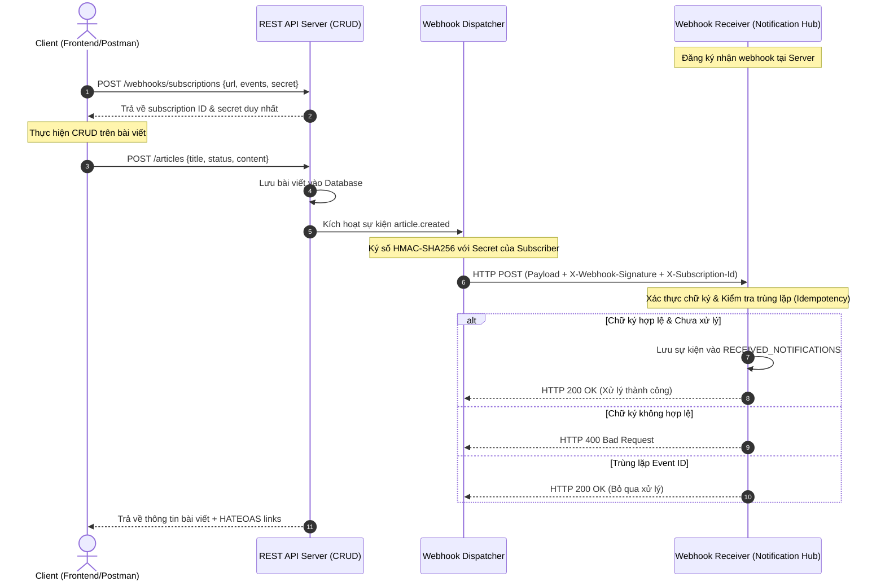

# Buổi 11-12: API Design Patterns

Mục tiêu của buổi học này là giúp bạn làm chủ các mẫu thiết kế API phổ biến trong kiến trúc hiện đại, biết cách phối hợp chúng trong một hệ thống thực tế và giải quyết các bài toán về bảo mật cũng như tính lặp lại (idempotency) của Webhook.

Hệ thống đi kèm một **Interactive Web Dashboard** được thiết kế hiện đại tại trang chủ (`/`), cho phép thao tác trực quan và mô phỏng thực hành.

---

## 1) Các Mẫu Thiết Kế API Trọng Tâm

### 1. CRUD (Create-Read-Update-Delete) Pattern

Mẫu thiết kế hướng tài nguyên cơ bản. Dữ liệu được coi là các tài nguyên (resource) định danh bằng URI và thao tác thông qua các phương thức HTTP:

- `POST /articles`: Tạo bài viết mới.
- `GET /articles/<id>`: Đọc thông tin bài viết.
- `PUT /articles/<id>`: Cập nhật thông tin bài viết.
- `DELETE /articles/<id>`: Xóa bài viết.

### 2. Query Pattern

Thay vì viết các endpoint riêng lẻ cho mỗi loại tìm kiếm, ta chuẩn hóa các tham số truy vấn (query parameters) trên tài nguyên danh sách:

- **Search (`q`)**: Lọc mờ theo từ khóa tiêu đề: `GET /articles?q=design`.
- **Filtering (`status`)**: Lọc chính xác theo thuộc tính: `GET /articles?status=published`.
- **Pagination (`page`, `limit`)**: Phân trang để bảo vệ tài nguyên máy chủ: `GET /articles?page=1&limit=5`.

### 3. HATEOAS (Hypermedia As The Engine Of Application State)

Một cấp độ trưởng thành cao của REST API (REST Maturity Model Level 3). Phản hồi từ máy chủ chứa không chỉ dữ liệu mà còn cả các liên kết liên quan (`links`), chỉ dẫn các hành động tiếp theo client có thể thực hiện:

```json
"links": {
  "self": "http://localhost:8000/articles/1",
  "update": "http://localhost:8000/articles/1",
  "delete": "http://localhost:8000/articles/1",
  "list": "http://localhost:8000/articles"
}
```

_Lợi ích:_ Giảm sự phụ thuộc cứng (hardcoding) URL ở phía Client. Khi URL trên Server thay đổi, Client dựa vào tên quan hệ (relation key như `update`, `delete`) để gọi động.

### 4. Event-Driven Pattern

Hệ thống phát ra các sự kiện khi trạng thái tài nguyên thay đổi, thay vì bắt các dịch vụ khác phải liên tục kéo (polling) dữ liệu.

- Trong ứng dụng này, khi một bài viết được tạo, cập nhật hoặc xóa, hệ thống sẽ phát đi sự kiện tương ứng (`article.created`, `article.updated`, `article.deleted`).

### 5. Webhook Pattern

Là cơ chế giúp hệ thống tự động đẩy dữ liệu sự kiện (event payload) đến các dịch vụ bên ngoài (subscriber) thông qua HTTP POST request ngay khi sự kiện xảy ra (Push model).

- **Subscription**: Cho phép client đăng ký nhận sự kiện tại `POST /webhooks/subscriptions`.
- **Delivery**: Khi có sự kiện, hệ thống duyệt qua danh sách subscriber và gọi HTTP POST đến URL đăng ký.

---

## 2) So Sánh & Lựa Chọn: REST, gRPC, GraphQL

| Tiêu chí                 | REST (HTTP/1.1 & HTTP/2)                  | gRPC (HTTP/2)                                                          | GraphQL (HTTP/1.1 & HTTP/2)                                                          |
| :----------------------- | :---------------------------------------- | :--------------------------------------------------------------------- | :----------------------------------------------------------------------------------- |
| **Giao thức truyền tải** | JSON hoặc XML qua HTTP                    | Protocol Buffers (Nhị phân) qua HTTP/2                                 | JSON qua HTTP                                                                        |
| **Kiểu tương tác**       | Hướng tài nguyên (CRUD)                   | Hướng thủ tục (RPC - Remote Procedure Call)                            | Hướng đồ thị (Graph query)                                                           |
| **Hiệu năng**            | Trung bình (do overhead header văn bản)   | Cực cao (nén nhị phân, streaming hai chiều)                            | Phụ thuộc vào độ phức tạp của câu truy vấn                                           |
| **Tính linh hoạt**       | Kém (Client nhận toàn bộ payload cố định) | Thấp (Schema cố định do file `.proto`)                                 | Rất cao (Client tự định nghĩa trường cần lấy)                                        |
| **Trường hợp sử dụng**   | Public API, Web app phổ thông, dễ cache.  | Microservices giao tiếp nội bộ, IoT, Mobile app cần tối ưu băng thông. | Frontend Dashboard phức tạp gom dữ liệu từ nhiều nguồn (BFF - Backend For Frontend). |

---

## 3) Kiến Trúc Tích Hợp Webhook & Hệ Thống Thông Báo

Dưới đây là mô hình hoạt động của hệ thống Webhook tích hợp với hệ thống nhận thông báo (Notification Receiver) trong ứng dụng này:



---

## 4) Hướng Dẫn Chạy & Thực Hành Mô Phỏng Lỗi

### Chuẩn bị môi trường & Khởi chạy

1. Cài đặt thư viện:
   ```bash
   pip install -r requirements.txt
   ```
2. Chạy ứng dụng Python:
   ```bash
   python main.py
   ```
3. Truy cập Dashboard tương tác bằng trình duyệt tại: **http://localhost:8000**
4. Hoặc truy cập Swagger UI tài liệu API tại: **http://localhost:8000/apidocs/**

---

### Bài Thực Hành 1: Tích Hợp Webhook Bình Thường

1. Trên giao diện Dashboard, tại khung **Webhook Subscriptions Manager**, nhấp nút **"Đăng ký Demo Webhook Receiver"**. Hệ thống sẽ tự động đăng ký endpoint nhận webhook demo nội bộ (`http://localhost:8000/webhooks/receiver`).
2. Di chuyển lên khung **Viết Bài Mới**, điền tiêu đề bài viết và nhấp **"Tạo Bài Viết & Phát Sự Kiện"**.
3. Ngay lập tức, tại khung **Notification Event Hub**, bạn sẽ thấy một bản ghi thông báo màu xanh lá cây xuất hiện với trạng thái **"Signature Verified"**.
4. Nhấp nút **"Xem chi tiết Payload"** để quan sát cấu trúc dữ liệu sự kiện gửi đến, bao gồm `X-Webhook-Id`, `X-Webhook-Signature`, `X-Webhook-Timestamp`.

---

### Bài Thực Hành 2: Kiểm Tra An Toàn Bảo Mật (Signature Verification)

1. Tích chọn ô **"Tamper Webhook Signature"** trong khung giả lập lỗi.
2. Thực hiện tạo một bài viết mới.
3. Lúc này, server sẽ giả lập việc ký bản tin bằng một khóa sai.
4. Phía đầu nhận (Receiver) phát hiện chữ ký trong header không trùng khớp với chữ ký tự tính toán, lập tức từ chối và ghi lại log màu đỏ: **"Security Failure (Lỗi chữ ký)"** với mã lỗi HTTP 400. Điều này mô phỏng cuộc tấn công giả mạo dữ liệu webhook từ bên ngoài.

---

### Bài Thực Hành 3: Kiểm Tra Tính Lặp Lại (Idempotency)

1. Tích chọn ô **"Duplicate Webhook Delivery"** trong khung giả lập lỗi.
2. Thực hiện cập nhật hoặc tạo một bài viết.
3. Máy chủ phát đi sự kiện sẽ gửi bản tin đó hai lần liên tiếp với cùng một `X-Webhook-Id`.
4. Quan sát khung **Notification Event Hub**:
   - Bản tin đầu tiên được xử lý thành công (màu xanh lá).
   - Bản tin thứ hai được đánh dấu là **"Duplicate Blocked (Tính lặp lại)"** (màu vàng cảnh báo) và không tạo ra thông báo trùng lặp lần hai. Điều này minh chứng cho tính lặp lại (idempotency) của Webhook Receiver: đảm bảo hệ thống không bị xử lý trùng dữ liệu (như thanh toán 2 lần, tạo 2 đơn hàng) khi mạng bị chập chờn dẫn đến gửi lặp.

---

## 5) Phân Tích Thực Tế: Stripe & GitHub Webhook Patterns

### Stripe API Design Patterns

- **Idempotency Keys**: Khi client gọi API ghi dữ liệu (như tạo thanh toán), Stripe yêu cầu truyền header `Idempotency-Key`. Nếu yêu cầu bị gián đoạn mạng, client gửi lại request kèm key đó. Stripe nhận diện và trả về kết quả đã xử lý trước đó mà không trừ tiền lần hai.
- **Webhook Security**: Stripe gửi header `Stripe-Signature` chứa timestamp (`t`) và chữ ký dạng `v1=...`. Đầu nhận phải kết hợp timestamp và raw body để tính toán mã HMAC-SHA256 nhằm chống tấn công phát lại (replay attacks - kẻ tấn công chặn bản tin cũ và gửi lại sau đó).
- **Rich Events**: Payload sự kiện của Stripe bao gồm toàn bộ đối tượng dữ liệu bị thay đổi, giúp client xử lý ngay lập tức mà không cần gọi ngược lại API để lấy chi tiết tài nguyên.

### GitHub API Design Patterns

- **Dual Support**: GitHub cung cấp cả hệ sinh thái REST API (đơn giản, dễ tiếp cận) và GraphQL API (giúp tối ưu hóa việc lấy dữ liệu của Issue/Pull Request vốn chứa nhiều mối quan hệ lồng nhau phức tạp).
- **Link Headers for HATEOAS**: REST API của GitHub phân trang bằng header `Link`:
  ```http
  Link: <https://api.github.com/user/repos?page=3&per_page=100>; rel="next",
        <https://api.github.com/user/repos?page=50&per_page=100>; rel="last"
  ```
  Client chỉ cần phân tích header này để lấy liên kết trang tiếp theo.
- **Webhook Ping**: Khi đăng ký webhook mới, GitHub gửi ngay một sự kiện giả lập `ping` để kiểm tra xem server nhận có hoạt động và trả về HTTP 200 hay không trước khi gửi sự kiện thật.

---

## 6) Câu Hỏi

1. **Vì sao ta nên kết hợp HATEOAS và Query Pattern trong API phân trang?**
   - Query Pattern định nghĩa cách Client yêu cầu phân trang (`page`, `limit`), còn HATEOAS sinh ra các đường dẫn động như `next` và `prev` trong kết quả trả về. Sự kết hợp này giúp Client không phải tự tính toán số trang hoặc ghép nối chuỗi URL thủ công, chỉ cần gọi liên kết do Server cung cấp, giúp giảm thiểu lỗi logic ở Client.

2. **Webhook có đảm bảo phân phối sự kiện đúng 1 lần (Exactly-Once) không? Làm thế nào để giải quyết?**
   - Không. Do các sự cố về mạng (network timeout), Webhook chỉ đảm bảo giao hàng ít nhất một lần (At-Least-Once). Nếu Server gửi webhook thành công nhưng không nhận được phản hồi ACK từ Receiver do mạng đứt, Server sẽ thực hiện gửi lại (retry). Để giải quyết, Receiver bắt buộc phải triển khai cơ chế **Idempotency** bằng cách lưu trữ danh sách `X-Webhook-Id` đã xử lý và kiểm tra trước khi thực thi logic nghiệp vụ.

3. **Chữ ký Webhook (HMAC) bảo vệ hệ thống khỏi những lỗ hổng bảo mật nào?**
   - **Giả mạo nguồn gốc (Spoofing)**: Đảm bảo request thực sự đến từ hệ thống phát sự kiện tin cậy, vì chỉ bên phát và bên nhận biết Secret Key chung.
   - **Thay đổi nội dung (Tampering)**: Đảm bảo dữ liệu truyền tải không bị chỉnh sửa trên đường truyền mạng, vì bất kỳ sự thay đổi nào dù nhỏ nhất trong body cũng làm thay đổi hoàn toàn mã HMAC tính toán.

4. **Khi nào thì GraphQL thực sự vượt trội hơn REST API?**
   - Khi client là một ứng dụng di động hoặc dashboard có giao diện phức tạp, cần hiển thị thông tin lồng nhau từ nhiều thực thể khác nhau (ví dụ: hiển thị bài viết cùng thông tin tác giả, danh sách bình luận, lượt thích của từng bình luận). Với REST, ta phải gọi 3-4 API riêng biệt (under-fetching). Với GraphQL, client chỉ cần gửi 1 câu truy vấn chính xác những trường cần hiển thị, tiết kiệm tài nguyên mạng và tối ưu tốc độ tải trang.
